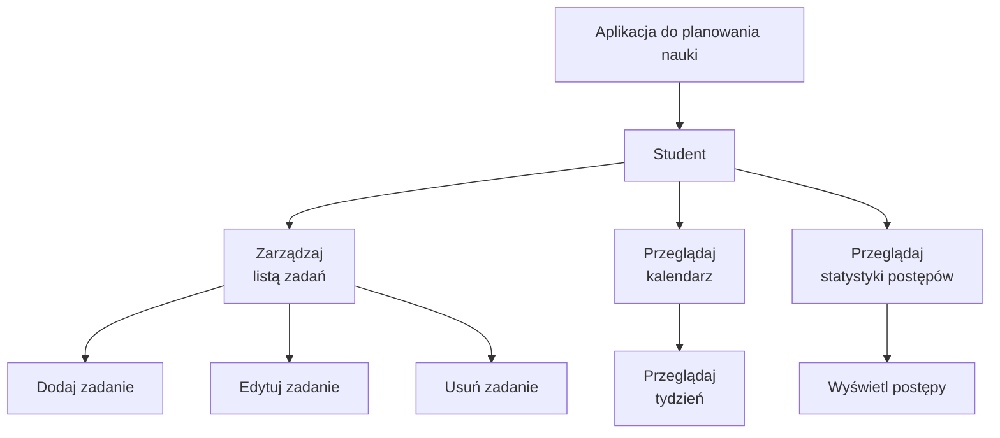

```mermaid
flowchart TD
    A["Aplikacja do planowania nauki"]
    S["Student"]

    A --> S

    S --> ZL["Zarządzaj<br/>listą zadań"]
    S --> K["Przeglądaj<br/>kalendarz"]
    S --> ST["Przeglądaj<br/>statystyki postępów"]

    ZL --> DZ["Dodaj zadanie"]
    ZL --> EZ["Edytuj zadanie"]
    ZL --> UZ["Usuń zadanie"]

    K --> PT["Przeglądaj<br/>tydzień"]

    ST --> WP["Wyświetl postępy"]
```
